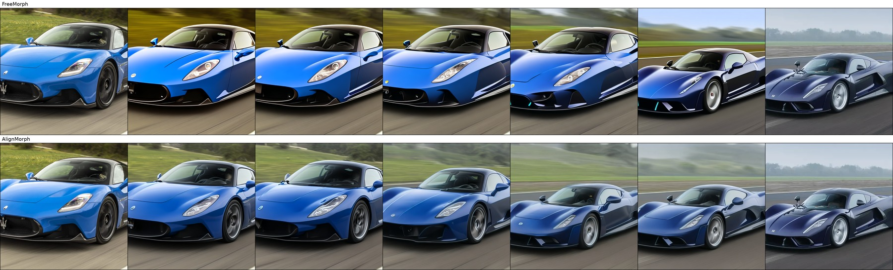
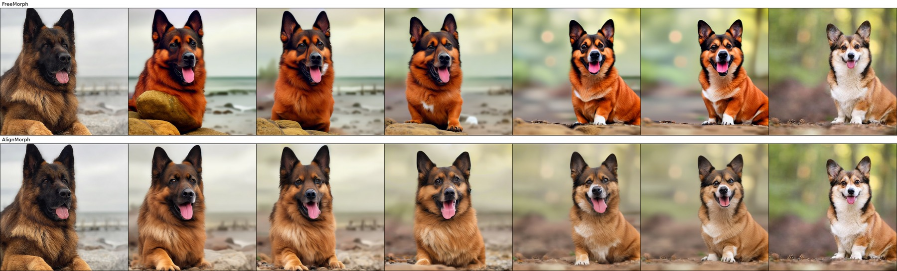
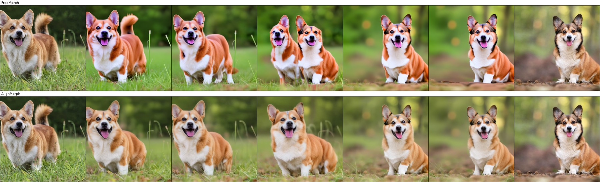

# AlignMorph

Official implementation of **AlignMorph**.

Training-free image morphing with semantic correspondence and multiband latent
transport. Given two images and their captions, AlignMorph generates a sequence
of seven transition frames.


## Installation

Python 3.9 and a CUDA-capable GPU are required for generation. The examples use
PyTorch 2.8.0 with CUDA 12.8 and a GPU with 24 GB memory.

```bash
conda create -n alignmorph python=3.9 -y
conda activate alignmorph
python -m pip install torch==2.8.0 torchvision==0.23.0 --index-url https://download.pytorch.org/whl/cu128
python -m pip install -r requirements.txt
python scripts/prepare_model.py --output models/sd21_768
```

See [model setup](docs/models.md) for downloading or using a matching local
checkpoint. Model weights are not included.

## Quick start

The repository includes all input images and captions for our 21-pair evaluation
selection in [`examples/pairs21.jsonl`](examples/pairs21.jsonl).
See the [pair index](examples/images/README.md) for the source and target of each pair.
Precomputed correspondence maps and comparison figures are included for three
ready-to-run examples: `car_01`, `dog_01`, and `dog_08`, listed in
[`examples/pairs.jsonl`](examples/pairs.jsonl). Generate one example:

```bash
python run.py --pairs examples/pairs21.jsonl \
  --correspondence examples/correspondence --model models/sd21_768 \
  --ids car_01 --output outputs/example
```

Use `--ids car_01 dog_01 dog_08` to generate all three examples with bundled maps.
Results are saved as seven-frame PNG strips. Existing outputs are not overwritten;
choose a new output directory for each run. Keep the full 21-pair manifest and
select IDs to preserve its sampling order; no maps are needed for skipped pairs.

## Warping visualization

Inspect latent transport and its low- and high-frequency components:

```bash
python scripts/visualize_warping.py --model models/sd21_768 \
  --ids car_01 dog_08 --output outputs/warping
```

Open `outputs/warping/index.html` to view the full latent warp, multiband warp,
low-frequency reconstructions, high-frequency terms, draft operands, and midpoint.
This command uses the VAE without diffusion denoising. It also saves the raw
tensors for further analysis.

To visualize the exact sampled latents from a generation run:

```bash
python run.py --pairs examples/pairs21.jsonl \
  --correspondence examples/correspondence --model models/sd21_768 \
  --ids car_01 --save-latents --output outputs/morph
python scripts/visualize_warping.py --model models/sd21_768 \
  --ids car_01 --latents-dir outputs/morph --output outputs/warp_exact
```

See [the visualization guide](docs/warping.md) for the figures, tensor interface,
and interpretation of the frequency bands.

## Example comparisons

The following three examples illustrate image morphing across layout changes.
Each comparison shows **FreeMorph on top** and **AlignMorph below**.

### car_01



### dog_01



### dog_08



[View the example comparisons](examples/README.md), or open
[`examples/index.html`](examples/index.html). Each figure shows FreeMorph above
AlignMorph. FreeMorph results use its
[official implementation](https://github.com/yukangcao/FreeMorph).
The [example guide](examples/README.md) includes commands for rerunning both methods.

## All 21 pairs

These 21 pairs feature semantically corresponding subjects, including cars,
motorcycles, and dogs, with large spatial displacements and differences in pose
or layout. They illustrate morphing between images whose corresponding semantic
parts occupy substantially different positions.

The [full manifest](examples/pairs21.jsonl) records the source image, target image,
caption and pair ID for every pair, in the original evaluation order. Images are
stored once in `examples/images`; different pairs can reuse an endpoint.
The pair selection includes new endpoint combinations and original dataset pairs.
The underlying photographs come from Morph4Data; see [attribution](NOTICE.md).

After setting up the [feature environment](docs/correspondence.md), generate maps
for all 21 pairs:

```bash
python scripts/generate_correspondence.py --json_path examples/pairs21.jsonl \
  --output_dir outputs/correspondence21 \
  --featup_repo third_party/FeatUp --dinov2_repo third_party/dinov2
```

Switch back to the generation environment:

```bash
conda activate alignmorph
python run.py --pairs examples/pairs21.jsonl \
  --correspondence outputs/correspondence21 --model models/sd21_768 \
  --output outputs/alignmorph21
```

To generate only the three illustrated examples using the original 21-pair
sampling order and bundled maps:

```bash
python run.py --pairs examples/pairs21.jsonl \
  --correspondence examples/correspondence --model models/sd21_768 \
  --ids car_01 dog_01 dog_08 --output outputs/selected21
```

## Custom image pairs

Create a JSONL file with image paths relative to that file:

```json
{"exp_id": "car", "image_paths": ["images/source.png", "images/target.png"], "prompts": ["a red sports car", "a blue sports car"]}
```

[Extract correspondence maps](docs/correspondence.md), then run:

```bash
python run.py --pairs pairs.jsonl --correspondence outputs/correspondence \
  --model models/sd21_768 --output outputs/morphs
```

Correspondence extraction requires the separate feature environment described
in the linked guide. The three ready-to-run examples already include the maps.

## Acknowledgements

Built on [FreeMorph](https://github.com/yukangcao/FreeMorph),
[FeatUp](https://github.com/mhamilton723/FeatUp),
[DINOv2](https://github.com/facebookresearch/dinov2), and Stable Diffusion.
See [NOTICE.md](NOTICE.md) for attribution.
